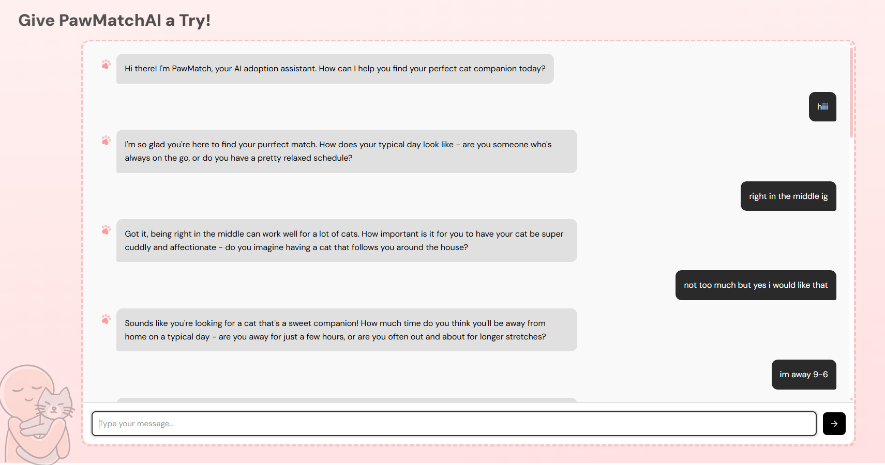
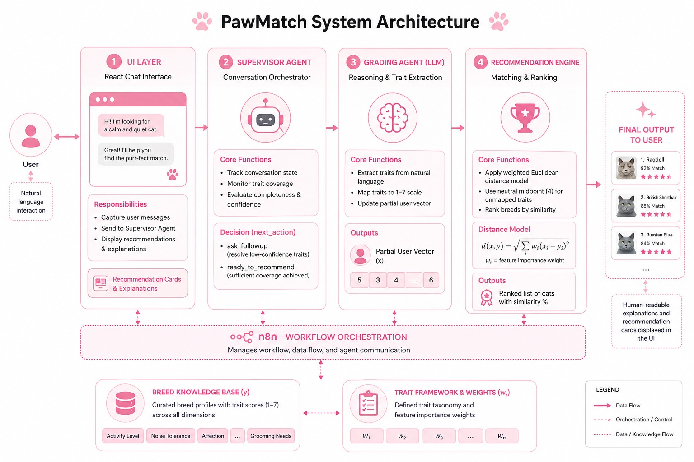
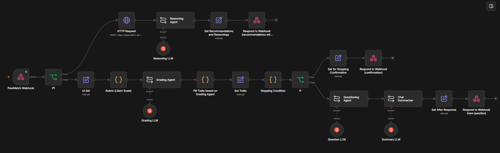
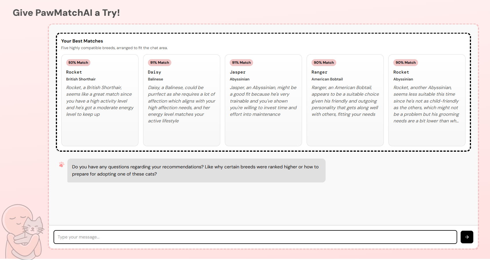

# 🐱 PawMatchAI

> An Agentic AI-powered conversational recommendation system that matches users with suitable cat breeds through adaptive dialogue, feature inference, and explainable recommendations.

---

## Overview

Choosing the right pet involves much more than selecting a breed by appearance. Traditional recommendation systems often rely on static questionnaires that fail to capture nuanced lifestyle preferences and require users to manually specify every characteristic.

PawMatchAI replaces rigid forms with an **agentic conversational workflow**. Instead of asking users to complete lengthy surveys, the system gradually learns their lifestyle through natural conversation, infers missing preferences using machine learning, and generates personalized, explainable breed recommendations.

The project combines **Large Language Models (LLMs)**, **Agentic AI**, and **classical machine learning** to create an adaptive recommendation experience.

---

## Demo

### Chat Interface

Users interact with PawMatchAI through a conversational interface that dynamically gathers lifestyle information instead of presenting a fixed questionnaire.

<p align="center">
    
</p>

---

## System Architecture

The overall architecture combines a React frontend with an n8n-based orchestration layer responsible for coordinating multiple AI agents and the recommendation engine.

<p align="center">
    
</p>

---

## Features

* 🤖 Agentic conversational workflow
* 💬 Natural language preference collection
* 🧠 LLM-powered behavioral trait extraction
* 🔄 Adaptive follow-up questioning
* 📊 OLS-based feature inference
* 📈 Weighted similarity recommendation engine
* 🔍 Explainable AI recommendations
* 🐈 Household-aware breed filtering
* ⚡ Real-time conversation orchestration using n8n

---

# Methodology

## 1. Conversational Preference Collection

Instead of asking users to complete lengthy forms, PawMatchAI collects preferences through natural conversation.

The system explicitly extracts only five primary lifestyle traits:

* Activity Level
* Affection Preference
* Grooming Willingness
* Noise Tolerance
* Time Spent Away From Home

This significantly reduces user effort while maintaining recommendation quality.

---

## 2. Agentic Workflow

The conversational pipeline is orchestrated using **n8n**.

Rather than relying on a single chatbot, PawMatchAI coordinates multiple specialized AI agents, each responsible for a distinct task.

### Grading Agent

* Extracts structured behavioral traits from natural language responses.
* Assigns confidence scores for each extracted preference.
* Updates the user's evolving profile.

### Supervisor Agent

* Maintains conversation state.
* Evaluates profile completeness.
* Determines whether another question is required.
* Controls overall workflow execution.

### Questioning Agent

* Generates adaptive follow-up questions.
* Targets only missing or uncertain traits.
* Prevents repetitive or unnecessary questioning.

Unlike traditional chatbots, the conversation terminates dynamically only after sufficient information has been collected.

---

## 3. Feature Inference

Only five traits are explicitly collected from the user.

The remaining behavioral characteristics are inferred using **Ordinary Least Squares (OLS) Regression**, allowing the system to construct a complete behavioral representation without overwhelming users with excessive questions.

The final output is a **10-dimensional behavioral profile**.

---

## 4. Recommendation Engine

Every completed user profile is compared against breed profiles using **Weighted Euclidean Similarity**.

The recommendation engine:

* Computes similarity scores
* Ranks compatible breeds
* Applies household compatibility filters
* Produces explainable recommendations through an LLM reasoning stage

Rather than simply recommending a breed, the system explains *why* each recommendation matches the user's lifestyle.

---

# Workflow

The entire conversational pipeline is orchestrated through **n8n**, coordinating multiple AI agents responsible for information extraction, dialogue management, recommendation generation, and explanation.

<p align="center">
    
</p>

The workflow includes:

* **Webhook** — Receives incoming user requests.
* **Grading Agent** — Extracts structured traits from conversational responses.
* **Trait Update Logic** — Maintains and updates the evolving user profile.
* **Stopping Condition** — Determines whether additional information is required.
* **Questioning Agent** — Generates adaptive follow-up questions.
* **Chat Summarizer** — Compresses conversation history for efficient context management.
* **Recommendation Service** — Retrieves the most compatible breeds.
* **Reasoning Agent** — Generates grounded explanations for each recommendation.
* **Webhook Response** — Returns either the next question or the final recommendations.

---

## Recommendation Output

After collecting sufficient information, PawMatchAI generates ranked recommendations accompanied by natural-language explanations describing why each breed matches the user's preferences.

<p align="center">
    
</p>

---

# Dataset

The recommendation engine utilizes a curated dataset containing approximately **2,796 cats**, represented using a shared behavioral schema inspired by the **Feline Five** personality framework.

The preprocessing pipeline includes:

* Data cleaning
* Missing value handling
* Duplicate removal
* Feature normalization
* Categorical encoding
* Standardization

---

# Tech Stack

### Frontend

* React

### Agentic AI

* n8n

### Artificial Intelligence

- Groq API
- Meta Llama 4 Scout 17B (16E Instruct)

### Machine Learning

* Ordinary Least Squares (OLS) Regression
* Weighted Euclidean Similarity

### Data Processing

* Python
* Pandas
* NumPy
* Scikit-learn

---

# How It Works

```text
User
   │
   ▼
React Chat Interface
   │
   ▼
Grading Agent
   │
   ▼
Update User Traits
   │
   ▼
Supervisor Agent
   │
   ├── More information required?
   │        │
   │       Yes
   │        ▼
   │  Questioning Agent
   │        │
   │        ▼
   │  Chat Summarizer
   │        │
   └────────┘
            │
            ▼
Recommendation Service
            │
            ▼
Reasoning Agent
            │
            ▼
Ranked Recommendations
```

---

# Key Innovations

Unlike conventional recommendation systems, PawMatchAI:

* Replaces static questionnaires with adaptive conversations.
* Uses multiple specialized AI agents instead of a single chatbot.
* Infers missing behavioral traits through machine learning.
* Combines LLM reasoning with classical statistical modeling.
* Produces explainable recommendations rather than opaque predictions.
* Dynamically determines when sufficient information has been collected before generating recommendations.

---

# Future Improvements

* Reinforcement learning from user feedback
* Personalized long-term user profiles
* Multi-pet recommendation support
* Shelter-specific recommendation datasets
* Multi-modal image-assisted recommendations
* Stronger trait inference models

---

# Authors

* Amna Shah
* Zahab Jahangir
* Hafsa Nauman
* Hafsa Fatima
* Zehra Waqar
